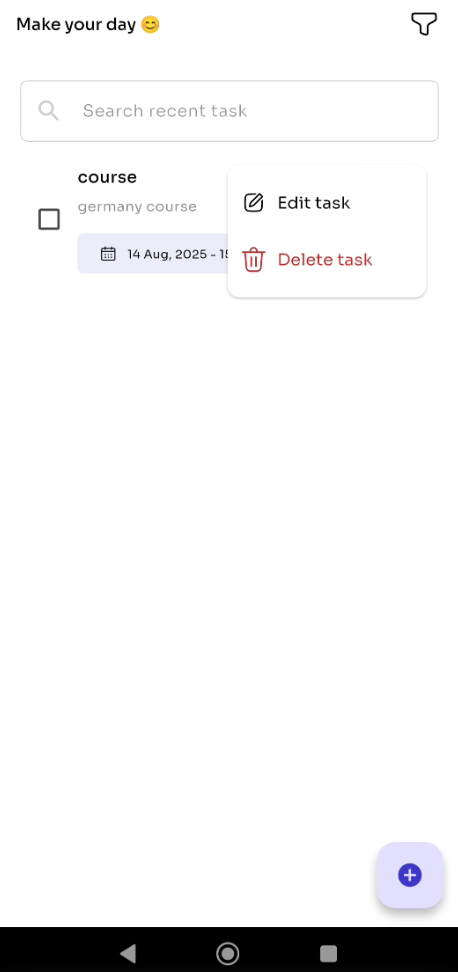
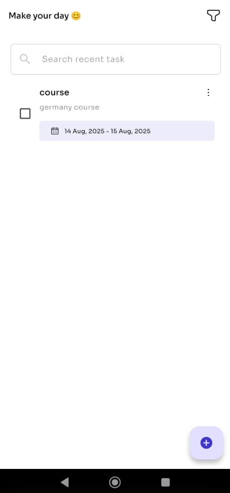
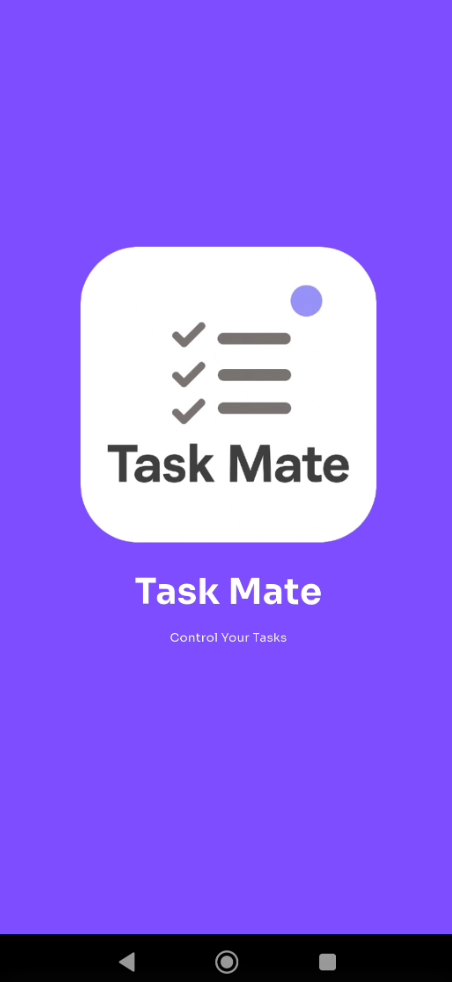
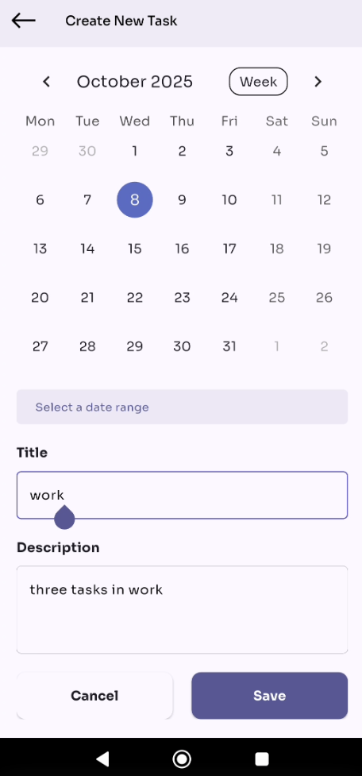

# Task Mate

Task Mate is a simple and smart task management application built with Flutter. It's designed to help you stay organized and productive by allowing you to easily create, edit, and track your daily tasks in an intuitive and modern interface. The application works completely offline, so you can manage your tasks anytime and anywhere without needing an internet connection.

## ✨ Features

*   **Offline First:** Works entirely offline, storing all your tasks locally on your device.
*   **Create, Edit, & Delete Tasks:** Full CRUD functionality for managing your to-do list.
*   **Date Range:** Assign start and end dates to your tasks using an integrated calendar.
*   **Task Sorting:** Organize your tasks by date, completion status (completed/pending).
*   **Search:** Quickly find tasks by searching for keywords in titles and descriptions.
*   **Clean UI:** A simple, modern, and user-friendly interface.
*   **State Management:** Utilizes the BLoC pattern for predictable and scalable state management.

## 🎥 Demo
<p align="left">
  
  
  
  
</p>


## 🛠️ Technology Stack

*   **Framework:** Flutter
*   **Language:** Dart
*   **State Management:** `flutter_bloc`
*   **Local Storage:** `shared_preferences`
*   **UI & Components:**
    *   `table_calendar`: For date selection and task scheduling.
    *   `lottie`: For animations.
    *   `flutter_svg`: For using SVG assets.
*   **Utilities:** `nb_utils`, `intl`, `page_transition`

## 🚀 Getting Started

Follow these instructions to get a copy of the project up and running on your local machine for development and testing.

### Prerequisites

You'll need to have the following installed on your machine:

*   [Flutter SDK](https://flutter.dev/docs/get-started/install) (latest stable version)
*   An IDE like [Android Studio](https://developer.android.com/studio) or [VS Code](https://code.visualstudio.com/) with Flutter & Dart plugins.
*   An emulator or a physical device (Android/iOS) to run the app.

### Installation

1.  **Clone the repository:**
    ```sh
    git clone https://github.com/AhmedAljamal15/Task-Mate.git
    ```

2.  **Navigate to the project directory:**
    ```sh
    cd Task-Mate
    ```

3.  **Install dependencies:**
    ```sh
    flutter pub get
    ```

4.  **Run the application:**
    ```sh
    flutter run
    ```

## 📂 Project Structure

The project is organized following a feature-first approach with a clean architecture pattern.

```
lib/
├── Core/              # Shared components, utilities, and app-wide configurations.
│   ├── routes/        # App routing logic (GoRouter).
│   └── utils/         # Constants, color palette, and helper functions.
│
├── Tasks/             # Main feature module for tasks.
│   ├── Data/          # Data layer.
│   │   ├── local/     # Local data source (SharedPreferences) and data models.
│   │   └── repository/ # Repository to abstract data sources.
│   └── Presentation/  # Presentation layer.
│       ├── bloc/      # BLoC logic for state management.
│       ├── pages/     # UI screens for the task feature.
│       └── widget/    # Reusable widgets specific to the task feature.
│
├── components/        # Common reusable widgets across the app.
├── main.dart          # Main entry point of the application.
└── splash_screen.dart # The initial splash screen.
